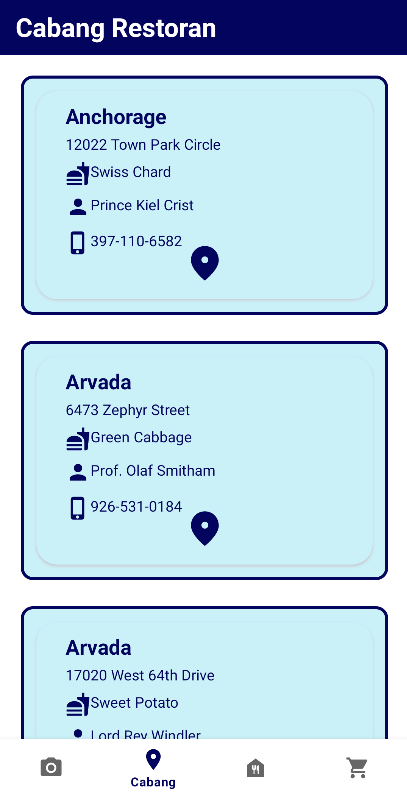
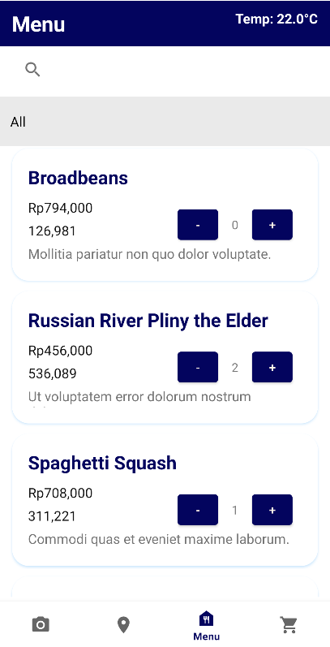
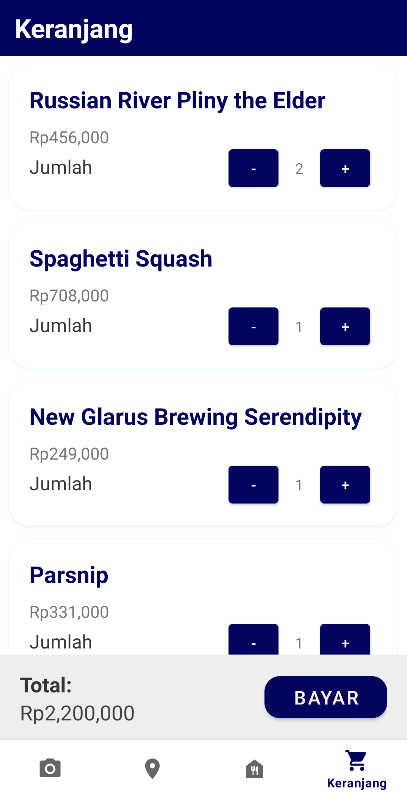
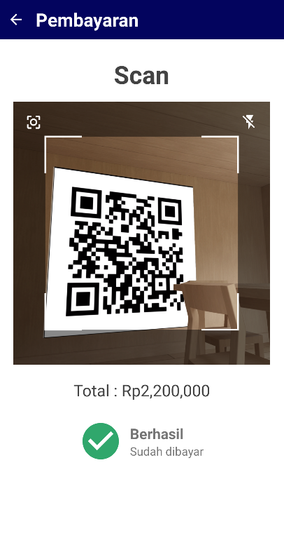
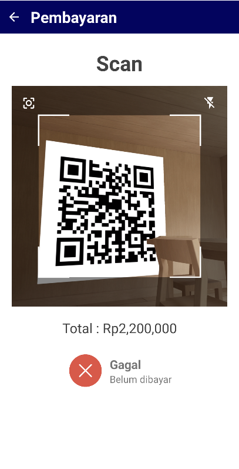

# IF3210 Pengembangan Aplikasi Pada Platform Khusus

> _This is a project done to fulfil one of IF3210's course assignment._

## Description

Aplikasi ini merupakan aplikasi berbasis android yang memiliki fungsionalitas utama seperti sebagai aplikasi pembelian makanan. Aplikasi ini memiliki fitur utama yaitu:

- Twibbon
- Daftar Cabang Restoran
- Daftar Menu (Makanan dan Minuman)
- Keranjang
- Pembayaran

## Requirements dan Library yang digunakan

Untuk menjalankan program pastikan Anda telah mendownload dan menginstall hal-hal berikut:

1. Android Studio
2. Emulator/Device Android

## How To Run

1. Clone repository ini
2. Open project pada android studio
3. Jalankan program dengan menekan tombol play pada android studio
4. Jalankan backend dengan cara membuka folder backend pada terminal dan mengetikkan perintah 'nama file' pada terminal

## Screenshot

1. Twibbon  
   
2. Daftar Cabang Restoran  
   
3. Daftar Menu (Makanan dan Minuman)  
   
4. Keranjang  
   
5. Pembayaran  

- Berhasil  
  
- Gagal  
  

## Authors

<table>
  <tr >
      <td><b>Nama</b></td>
      <td><b>NIM</b></td>
      <td><b>Pembagian Kerja</b></td>
      <td><b>Jumlah Jam Persiapan</b></td>
      <td><b>Jumlah Jam Pengerjaan</b></td>
    </tr>
    <tr >
      <td><a href="https://gitlab.informatika.org/leoniantoinette"><b>Flavia Beatrix Leoni Antoinette Santoso</b></a></td>
      <td>13520051</td>
      <td>Membuat fitur keranjang dan pembayaran</td>
      <td>26 Jam</td>
      <td>3 Minggu x 5 hari x 4 jam = 60 jam</td>
    </tr>
    <tr>
      <td><a href="https://gitlab.informatika.org/febryola"><b>Febryola Kurnia Putri</b></a></td>
      <td>13520140</td>
      <td>Membuat header dan navbar, menu cabang restoran, dan menu twibbon</td>
        <td>26 Jam</td>
        <td>3 Minggu x 5 hari x 4 jam = 60 jam</td>
    </tr>
    <tr>
      <td><a href="https://gitlab.informatika.org/Aloysiusgilang"><b>Aloysius Gilang Pramudya</b></a></td>
      <td>13520147</td>
        <td>Membuat menu header dan navbar, membuat menu makanan dan minuman</td>
        <td>26 jam</td>
        <td>3 Minggu x 5 hari x 4 jam = 60 jam</td>
    </tr>
</table>
